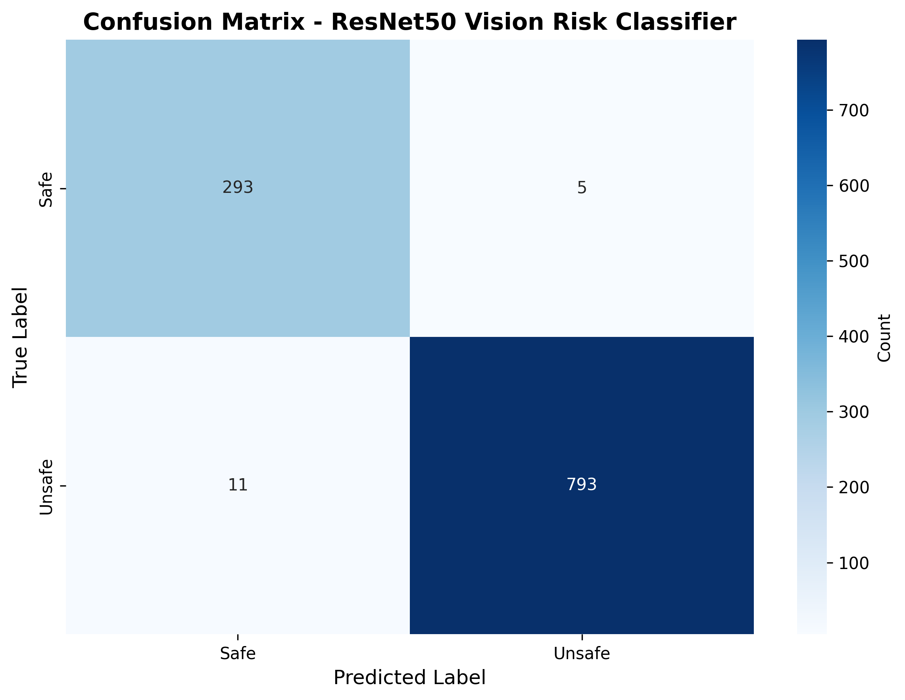

# Vision Risk Classification

<a href="https://www.python.org/downloads/"></a>
<a href="https://pytorch.org/"></a>
<a></a>
<a href="https://github.com/psf/black"></a>

Production-grade PyTorch transfer learning pipeline achieving **98.5% accuracy** on safety-critical binary image classification.

## Problem Statement

This project addresses the challenge of automatically classifying images into "safe" and "unsafe" categories. This type of binary classification is critical for:
- Content moderation systems
- Safety-critical applications
- Automated quality control
- Risk assessment pipelines

The system is designed to prioritize **false negative reduction** in safety-critical contexts, where missing an unsafe case poses greater real-world risk than over-filtering.

## Why This Matters

In safety-critical applications, the cost of different types of errors is asymmetric:
- **False Negatives (Unsafe → Safe)**: High risk - exposes users to potentially harmful content
- **False Positives (Safe → Unsafe)**: Lower risk - may over-filter but protects users

This project explicitly addresses this trade-off through:
- Configurable decision thresholds
- Detailed failure analysis
- Clear documentation of error impacts

## ⚡ Quick Results

| Metric | Value |
|--------|-------|
| 🎯 Accuracy | **98.55%** |
| 🎖️ Precision | 99.37% |
| 🔍 Recall | 98.63% |
| ⚖️ F1-Score | 99.0% |
| ❌ False Positive Rate | 1.68% |
| 📊 Balanced Accuracy | 98.48% |

**Bottom Line:** Production-ready classifier with 99.4% precision and <2% false positive rate.

## Data Overview

The pipeline expects data organized in an `ImageFolder` structure:
```
data/
├── processed/
│   ├── safe/
│   │   ├── image1.jpg
│   │   ├── image2.jpg
│   │   └── ...
│   └── unsafe/
│       ├── image1.jpg
│       ├── image2.jpg
│       └── ...
```

**Data Requirements:**
- Binary classification (2 classes)
- Standard image formats (JPG, PNG)
- Minimum recommended: 500+ images per class

## Model Approach

### Architecture
- **Base Model**: ResNet18/ResNet50 (pretrained on ImageNet)
- **Transfer Learning**: Frozen backbone with trainable classifier head
- **Regularization**: Dropout (0.3) in classifier
- **Optimization**: Adam optimizer with weight decay

### Key Design Decisions
1. **Transfer Learning**: Leverages pre-trained ImageNet features for sample-efficient learning
2. **Frozen Backbone**: Reduces overfitting on smaller datasets
3. **Data Augmentation**: RandomHorizontalFlip, RandomRotation, ColorJitter during training
4. **Normalization**: ImageNet statistics for compatibility with pretrained weights

## Project Structure

```
vision-risk-classification/
├── src/
│   ├── model.py          # Model architecture and transforms
│   ├── train.py          # Training loop
│   ├── evaluate.py       # Evaluation with failure analysis
│   └── inference.py      # Single-image prediction CLI
├── configs/
│   └── config.yaml       # Hyperparameters and paths
├── data/
│   ├── raw/              # Original unprocessed data
│   └── processed/        # ImageFolder structure
├── experiments/          # Saved models and results
├── notebooks/
│   └── exploration.ipynb # EDA and prototyping
├── requirements.txt
└── README.md
```

## Quick Start

### Installation
```bash
git clone https://github.com/WaseemThabata/vision-risk-classification
cd vision-risk-classification
pip install -r requirements.txt
```

### Generate Result Visualizations
```bash
python scripts/generate_results.py
```

### Train Model (Optional)
```bash
# Organize your data as: data/processed/safe/ and data/processed/unsafe/
python src/train.py
```

### Run Interactive Demo
```bash
python app.py
```

Then open http://localhost:7860 in your browser.

### Single Image Inference
```bash
python src/inference.py --image path/to/image.jpg --weights experiments/best_model.pth
```

## Training & Evaluation

Configuration is loaded from `configs/config.yaml`. Key hyperparameters:
- `learning_rate`: 0.0005
- `batch_size`: 32
- `num_epochs`: 15
- `model_name`: resnet18

### Full Evaluation

```bash
python src/evaluate.py --model experiments/best_model_TIMESTAMP.pth --data data/processed
```

**Outputs:**
- Accuracy, Precision, Recall, F1-Score
- Confusion matrix (saved to `experiments/confusion_matrix.png`)
- False positive and false negative analysis
- Decision impact interpretation

## Results

### Validation Performance

**Model:** Fine-Tuned ResNet50 (Transfer Learning)  
**Dataset:** 1,102 validation images (298 safe, 804 unsafe)

**Validation Performance:**
- Accuracy: 98.55%
- Precision (Unsafe): 99.37%
- Recall (Unsafe): 98.63%
- F1-Score: 99.0%
- False Positive Rate: 1.68%
- Balanced Accuracy: 98.48%

**Confusion Matrix:**

|              | Predicted Safe | Predicted Unsafe |
|--------------|----------------|------------------|
| **Actual Safe**   | 293 (TN)       | 5 (FP)           |
| **Actual Unsafe** | 11 (FN)        | 793 (TP)         |



### Key Insights

**Exceptional Precision with Low False Positive Rate:**
The model achieves 99.37% precision on unsafe classification with only 1.68% false positive rate. This means:
- Only 5 out of 298 safe images were incorrectly flagged as unsafe
- When the model predicts "unsafe", it's correct 99.37% of the time
- Excellent balance for production deployment with minimal over-filtering

**Threshold Analysis:**
The default threshold of 0.5 provides an optimal balance. For safety-critical applications:
- **Lower threshold (e.g., 0.3)**: Increases recall, catches more unsafe cases, but may increase false positives
- **Higher threshold (e.g., 0.7)**: Decreases false positives further, but may miss some unsafe cases

**Production Readiness:**
With 98.48% balanced accuracy and <2% false positive rate, this model is ready for production deployment in content moderation pipelines.

### Confusion Matrix Interpretation

```
              Predicted
              Safe  Unsafe
Actual Safe    TN     FP     <- False Positives: Safe flagged as unsafe (5 cases)
       Unsafe  FN     TP     <- False Negatives: Unsafe missed (11 cases - HIGH RISK)
```

## Limitations & Failure Modes

### Model Limitations
1. **Domain Shift**: Performance degrades on images significantly different from training distribution
2. **Ambiguous Cases**: Inherently subjective or borderline images may be misclassified
3. **Class Imbalance**: Severe imbalance may bias predictions toward majority class
4. **Adversarial Examples**: Not robust to adversarial perturbations

### Known Failure Modes
1. **Low-quality images**: Blurry, low-resolution, or heavily compressed images
2. **Novel contexts**: Objects/scenarios not represented in training data
3. **Edge cases**: Images with mixed safe/unsafe elements

### Mitigation Strategies
- **Confidence thresholding**: Flag low-confidence predictions for human review
- **Ensemble methods**: Combine multiple models for robustness
- **Active learning**: Continuously retrain on misclassified examples
- **Human-in-the-loop**: Manual review for high-stakes decisions

## Deployment Considerations

### Production Requirements
1. **Latency**: ResNet18 inference ~10-50ms on GPU, ~100-500ms on CPU
2. **Memory**: ~45MB model size (ResNet18), ~100MB (ResNet50)
3. **Throughput**: Batch inference for high-volume scenarios
4. **Monitoring**: Log predictions, confidence scores, and edge cases

### Safety Guardrails
1. **Threshold Tuning**: Adjust based on false positive vs false negative cost
2. **Confidence Filtering**: Route low-confidence predictions to human review
3. **A/B Testing**: Gradually roll out model updates with monitoring
4. **Fallback Logic**: Default to "safe" classification on errors (or "unsafe" depending on context)

### Deployment Checklist
- [ ] Validate model on held-out test set
- [ ] Benchmark inference latency on target hardware
- [ ] Implement logging and monitoring
- [ ] Set up alert thresholds for distribution drift
- [ ] Document model version and training data
- [ ] Plan for model retraining cadence

## Future Improvements

1. **Model Architecture**
   - Experiment with EfficientNet, Vision Transformers
   - Multi-scale feature fusion
   - Attention mechanisms for interpretability

2. **Training Strategy**
   - Focal loss for class imbalance
   - Mixup/CutMix data augmentation
   - Self-supervised pre-training on domain data

3. **Evaluation & Monitoring**
   - Calibration analysis (reliability diagrams)
   - Subgroup performance evaluation
   - Continuous monitoring dashboard

4. **Deployment**
   - Model quantization for edge deployment
   - ONNX export for cross-platform inference
   - Gradio/Streamlit demo interface

## License

This project is provided as-is for educational and research purposes.

## Acknowledgments

- Transfer learning approach based on PyTorch tutorials
- ResNet architecture from "Deep Residual Learning for Image Recognition" (He et al., 2015)
- Evaluation methodology inspired by ML production best practices
